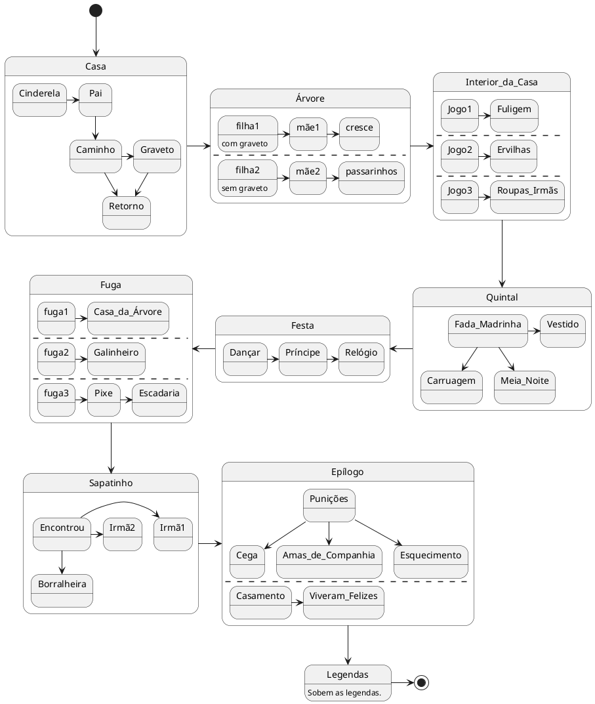

```plantuml

@startuml

[*] --> Casa
Casa -> Árvore
Árvore -> Interior_da_Casa
Interior_da_Casa --> Quintal
Quintal -left-> Festa
Festa -left-> Fuga
Fuga --> Sapatinho
Epílogo --> Legendas
Sapatinho -> Epílogo
Legendas -> [*]

state Casa {
  Cinderela -> Pai
  Pai --> Caminho
  Caminho -> Graveto
  Caminho -> Retorno
  Graveto --> Retorno
}

state Árvore {
  state filha1 : com graveto
  filha1 -> mãe1
  mãe1 -> cresce
  ---
  state filha2 : sem graveto
  filha2 -> mãe2
  mãe2 -> passarinhos
}

state Interior_da_Casa {
  Jogo1 -> Fuligem
  ---
  Jogo2 -> Ervilhas
  ---
  Jogo3 -> Roupas_Irmãs
}

state Quintal {
  Fada_Madrinha -> Vestido
  Fada_Madrinha --> Carruagem
  Fada_Madrinha --> Meia_Noite
}

state Festa {
  Dançar -> Príncipe
  Príncipe -> Relógio
}

state Fuga {
  fuga1 -> Casa_da_Árvore
  ---
  fuga2 -> Galinheiro
  ---
  fuga3 -> Pixe
  Pixe -> Escadaria
}

state Sapatinho {
  Encontrou -> Irmã1
  Encontrou -> Irmã2
  Encontrou --> Borralheira
}

state Epílogo {
  Punições --> Cega
  Punições --> Amas_de_Companhia
  Punições --> Esquecimento
  ---
  Casamento -> Viveram_Felizes
}

state Legendas: Sobem as legendas.

@enduml
```
```